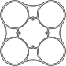

# Splinter 65

A 65mm carbon fiber whoop frame. Two plates: a base plate carrying the motors, 
nd a prop guard that sits on standoffs at prop blade height.

| Base plate | Prop guard |
| :---: | :---: |
|  |  |

Parametric OpenSCAD. `build.sh` exports DXF cut files and STEP solids, which
is what a CNC shop wants. Prebuilt files are attached to every
[release](https://github.com/einsz/Splinter-65/releases), so you can order
without installing anything.

|  | base | guard |
| --- | --- | --- |
| source | `base.scad` | `guard.scad` |
| thickness | 1.0 mm | 1.5 mm |
| envelope | 54.8 x 54.8 mm | 82.8 x 82.8 mm |
| mass, calculated | 0.97 g | 2.12 g |
| mass, measured | 0.89 - 1.03 g | 1.98 g |

Approximately 3.5 g for a complete frame with hardware.

Order the base plate in 1 mm. 1.5 mm works and is stronger, but the 1 mm plate
has not broken for me yet and the extra costs you around half a gram. Order the
guard in 1.5 mm or thicker. The guard is what hits things, and 1 mm guards broke
quite fast. Off course, if you dont mind the extra weight, you can also order it
in 2mm.

## Fits

- 65 mm diagonal motor distance
- 0702 class motors
- 31 mm (1.2 inch) props with 1 mm clearance
- 25.5 x 25.5 mm flight controller mount

## What you need

Four M2 nylon bolts, 15 mm or longer. They run the whole height of the stack,
from under the base plate to the top of the guard.

M2 nylon nuts, as spacers between everything. How many depends on your FC:

| FC mounting | nuts |
| --- | --- |
| 3 point, like the BetaFPV Matrix 5in1 II or Air 1S | 18 |
| 4 corner | 20 |

A 3 point board leaves one post with no corner to clamp, saving two nuts.

The nylon nuts should be ~1.5mm thick. What also works is a mix of 1 and 2mm
nuts, (12 x 1 mm + 6 x 2 mm for the 3 point, 12 x 1 mm + 8 x 2 mm for the 4 point
mounting)

Nylon instead of steel hardware. It is light, and in a crash the bolts absorb
some of the energy that instead would go into the carbon. The full set weighs
about 0.5 g, the same weight as a single M2 15mm bolt.

Motor screws must be 2 mm long on the 1 mm base plate, the same length the
BetaFPV Air65 II Champion uses. Longer ones can bottom out inside the motor. The
3 mm screws most motors ship with will work with a 1.5 mm base plate.

An Air65 II Champion is a great donor for this frame. Almost everything transfers
over. Easiest option if you are sourcing from scratch.

### Canopy and battery

Neither is currently part of this design.

The Air65 II canopy fits. Its screw holes need widening up a bit to fit over the
M2 bolts, which are wider than what it was designed for.

For the battery, one or two rubber band around the arms of the base plate work
well. There are also other TPU battery holders that can be held by the FC screws
on the bottom.

## Assembly

Bolts go up from underneath the base plate, head down. Nuts stack on each post
as spacers, first to set FC height, then above the board to lift the guard to
prop blade height, with one on top holding the guard down. How they split
depends on your FC thickness and where your blades sit.

## Building the files

Needs `openscad` on PATH. STEP conversion runs cadquery inside Docker, so you
need Docker but not a working local cadquery.

```sh
./build.sh          # both plates, DXF and STEP, into ./output
./build.sh guard    # one plate
STEP=0 ./build.sh   # DXF only, no Docker
```

Both `.scad` files default to `render_3d = true` so they preview as solids in
the OpenSCAD GUI. `build.sh` passes `-D render_3d=false` for 2D geometry that
exports as DXF.

## Ordering the carbon

All dimensions and DXF coordinates are in millimetres. Import the DXF files at
1:1 scale. OpenSCAD's DXF export does not include unit metadata, so verify that
the imported envelopes are 54.8 x 54.8 mm for the base and 82.8 x 82.8 mm for
the guard before ordering.

Fibre orientation is the biggest thing you can get wrong. A woven laminate
loaded along the fibres is much stiffer than the same at 45 degrees, and shops
rotate parts freely when nesting for material yield. Word it against the part,
not the file axes, so it survives any nest:

> The 0/90 fibre directions must run parallel to the motor arms. Parts may be
> flipped when nesting, but not rotated.

Carbon quality can also make a difference. T300 carbon works, but T700 will be
much more crash resistant. T700 will not be stiffer. The prop guard will
benefit nicely from the extra strength, for the base plate it does not matter
as much.

There are also other factors that can have impact on stiffness and durability,
like resin content and thickness tolerances of the carbon fiber.

## Safety and fabrication

Carbon fiber is electrically conductive. Keep the flight controller, exposed
pads and wiring insulated from the plates, and check that nothing can touch the
carbon after a crash.

Have the plates cut with suitable dust extraction. If you drill, sand or deburr
carbon yourself, use appropriate respiratory and eye protection and contain the
dust. Smooth or seal sharp edges where they can rub against wiring, rubber bands
or the LiPo wrapping.

Before arming, turn every propeller by hand and verify that it clears the guard.
Inspect the plates for cracks, splinters and delamination after hard impacts.

## Licence

Everything here, sources, generated files, scripts and this document, is
released under [CC BY-SA 4.0](https://creativecommons.org/licenses/by-sa/4.0/).

Use it, cut it, modify it, sell it. Credit me, and pass on changes to the
design files under the same licence.

> Splinter 65 by Julian Jakobs, https://github.com/einsz/Splinter-65,
> licensed CC BY-SA 4.0

CC BY-SA 4.0 applies to copyright and similar rights in the repository
materials; it does not grant patent rights. When sharing adapted design files,
retain the attribution and release them under the same licence. The legal
treatment of manufactured parts may vary by jurisdiction.

## Files

```
base.scad      base plate, 1.0 mm
guard.scad     prop guard, 1.5 mm
build.sh       exports DXF and STEP into ./output (git ignored)
dxf2step.py    DXF to extruded STEP, runs inside the cadquery container
LICENSE        CC BY-SA 4.0 legal code
docs/images/   rendered design previews
.github/       CI that builds the files and attaches them to releases
```
